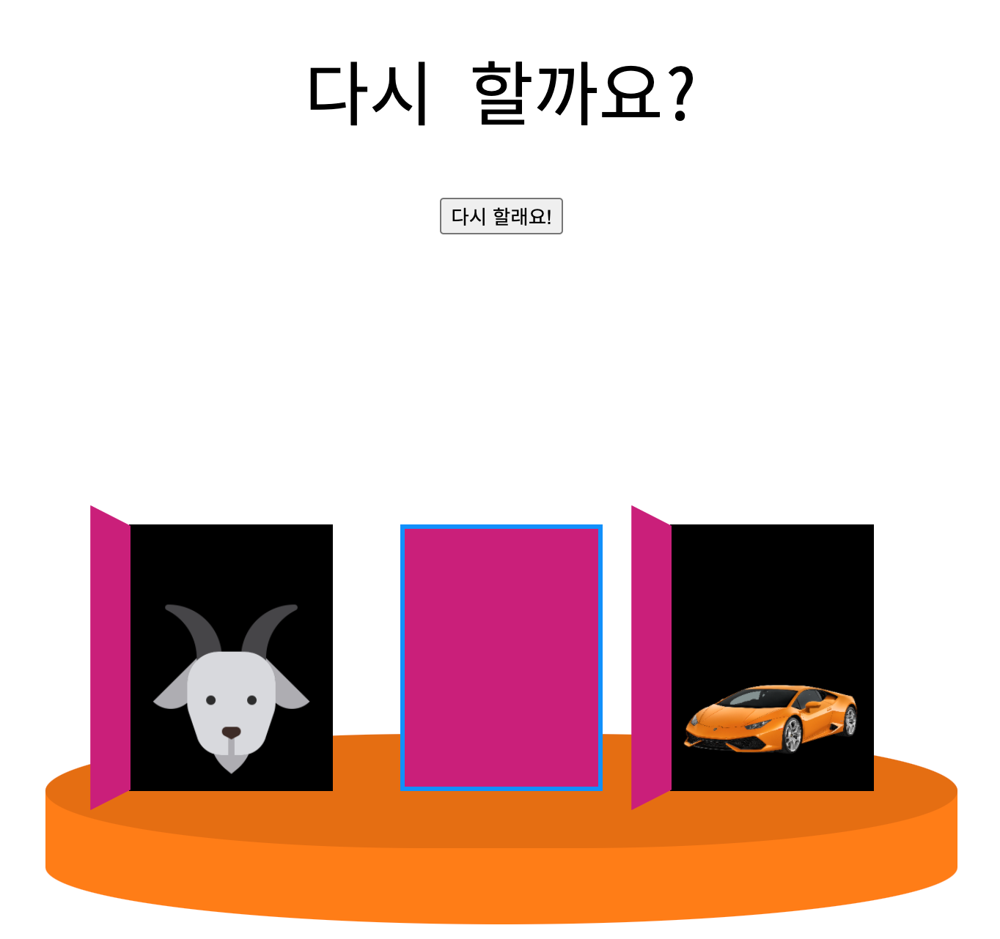
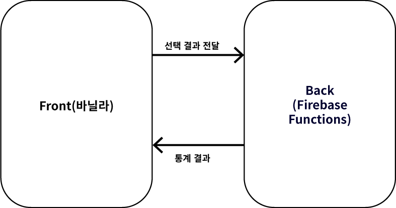

# 몬티홀 역설 프로젝트

몬티홀의 역설을 웹에서 보여주려고 시작한 프로젝트. 완성 후에 몬티홀 유튜브 영상들에다가 댓글로 url을 달아서 사람들을 불러모을 예정입니다.

https://montyhallbing.netlify.app/

- 21.02.20 오로지 프론트의 기능만을 구현, 디자인 업데이트와 통계 집계를 위한 서버 구축이 남아있음

## 목적

- 그럴듯한 UI로 실제 문을 선택해 염소나 차가 등장하도록 구성 
- 참여한 사람들의 통계를 수집해서 수학적인 통계에 근접하는지 확인

## 결과 예시

- 문을 선택하고, 선택하지 않은 문 중에서 하나를 열어 염소를 보여줍니다.
- 처음 선택을 바꾸거나, 바꾸지 않을 수 있고 해당 선택에 따른 결과를 보여줍니다.
- 선택결과를 통계에 반영합니다(예정).

## 구조

### 프론트엔드

- 문을 선택하면서 발생한 모든 경우에 대한 정보를 서버로 전송합니다. 
- 서버에서 통계 정보를 받아 화면에 표시합니다.

### 백엔드

- 프론트에서 전달 된 정보를 저장하고 통계로 가공합니다.

## 생각한 점

- 문을 열지 않아도 문 뒤에 뭐가 들었는지 알 수 없도록 할 것
  - 만약 미리 차와 염소에 대한 html태그가 렌더링 되어있는 경우 개발자 도구를 조금만 활용하면 문을 선택하지 않고도 미리 결과를 알 수 있습니다. 그래서 문을 선택했을 때 js를 통해 태그가 삽입되도록 하였습니다.
  - 코드를 통해 어떤 문 뒤에 차가 있는지를 모르게 하고 싶었습니다.
    - 코드 난독화를 한다고 해서 완벽히 문제가 해결되진 않습니다.
    - 어떤 문 뒤에 차가 있는지를 결정하는 변수를 함수안에 두어서 외부에서 접근할 수 없도록 하였습니다.
- transform과 transition을 적절히 사용해서 생동감 있는 UI를 만들어보고 싶었습니다.(업데이트 예정)
- 일러스트로 직접 염소와 차를 그려보고 싶었습니다(아직 그리진 않음. 학습 중.). 처음 생각은 디자이너가 쓰는 툴을 써보면서 협업할 때 상대방에 대한 이해를 더 하고 싶어서 그랬는데 도움이 될지는 모르겠네요.
- youtube에서 넘어올 경우 모바일 사용자가 많을 것이므로, 모바일 화면에 대한 대응을 해야합니다(예정).

